
**Summit (Challenge)**

I access <https://10-10-130-58.p.thmlabs.com/> 

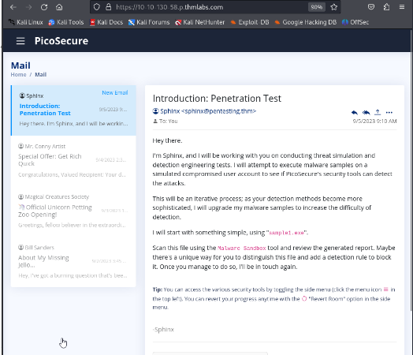

it seems that there is 4 mails

first mail, it tells me to scan the file ‘sample1.exe’ using ‘Malware Sandbox’ tool

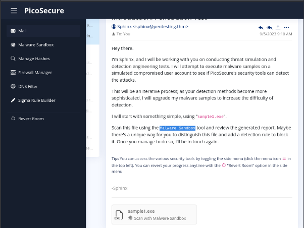

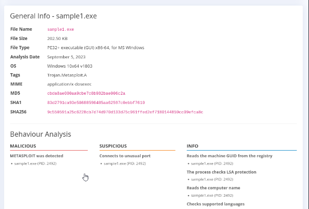

for our first flag, I add the MD5 to the BlockList 

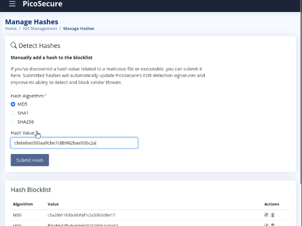

—-----------

for sample2.exe, it seems like the first one : 

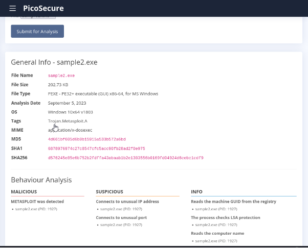

but it has an extra network section: 

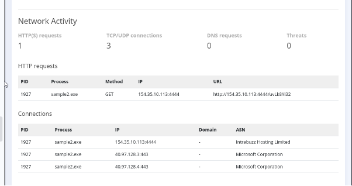

to get the second flag, i use the firewall rules, the malware makes a http request to http://154.35.10.113:4444/uvLk8YI32

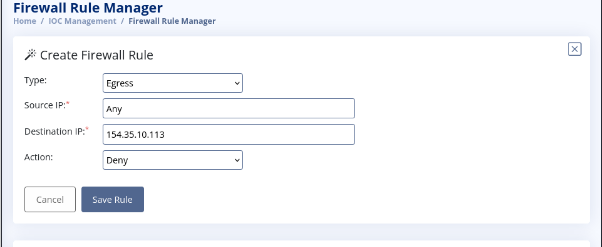

—-------

for sample3.exe , we have these sections, i can see that a new dns requests is showing : 

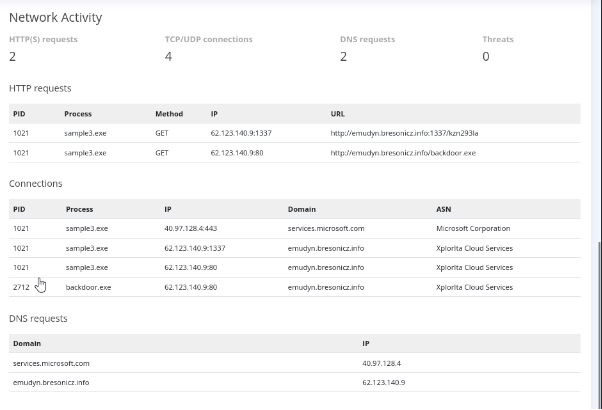

and this domain looks malicious ‘emudyn.bresonicz.info’ , so i will block it : 

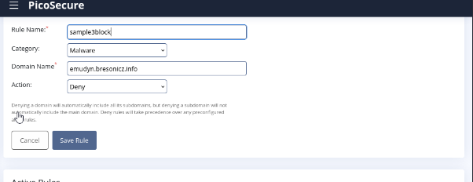

—-------------

for sample4.exe, i got an extra section called Registry Activity : 

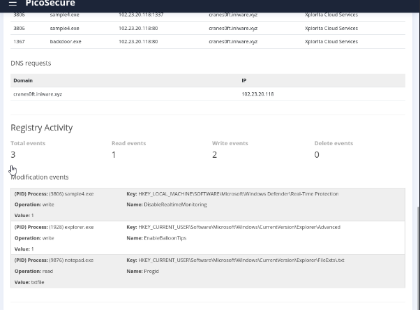

and this event looks malicious : 

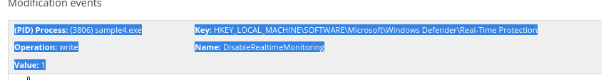

i got to ‘Sigma Rule Builder’ , ‘sysmon Event logs’ , ‘Registry Modifications’.

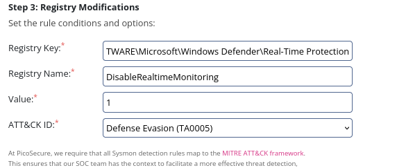

—-------------

for sample5.exe, 

i’m seeing a problem with the domain ‘bababa10la” and its ip ‘ 51.102.10.19’

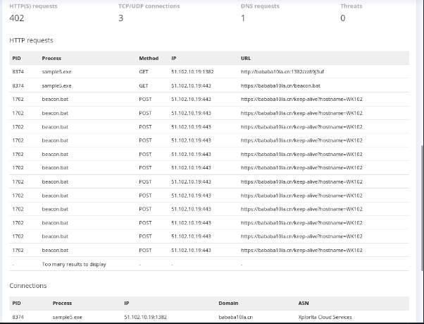

but , i will be investigating the ‘outgoing\_connections.log’ file

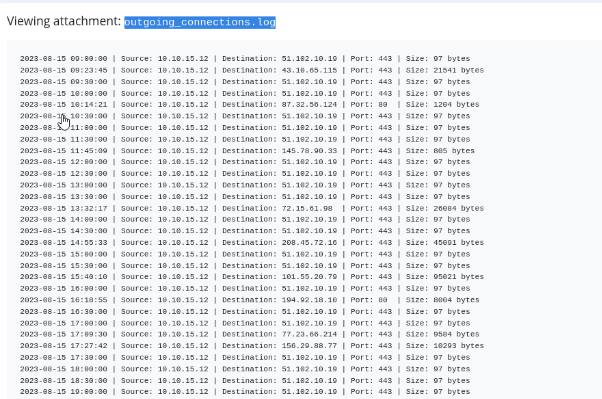

I can see that every 30 minutes , there is a connection that is happening, I can create a Sigma Rule , but now ‘Network Connection’

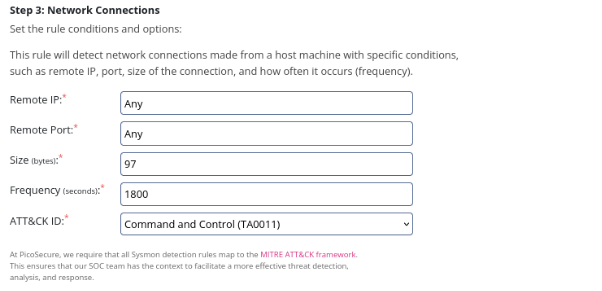

—--------------

for sample6.exe, i got the commands.log file : 

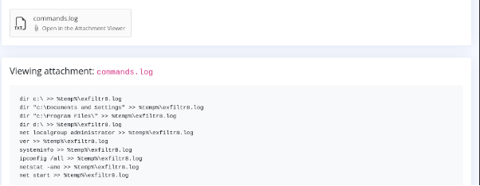

i am seeing exflitr8.log file

%temp%\exfiltr8.log

i  add another rule in Sigma: 

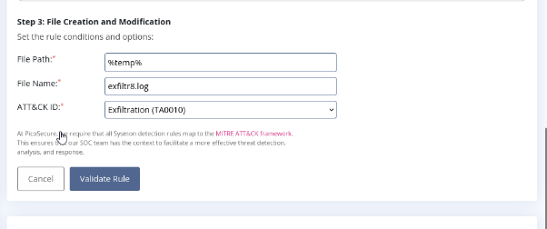

and i finished and got the 6 flags
